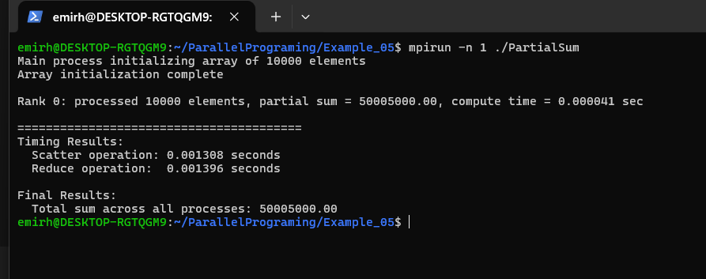
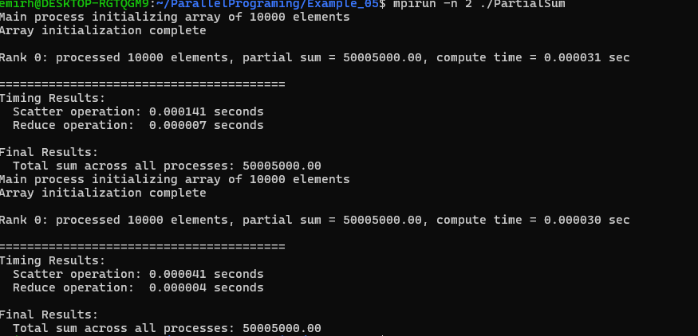
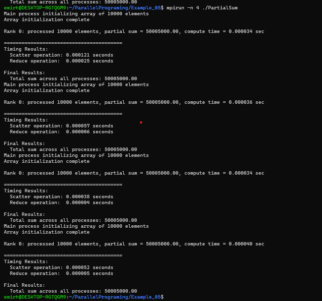
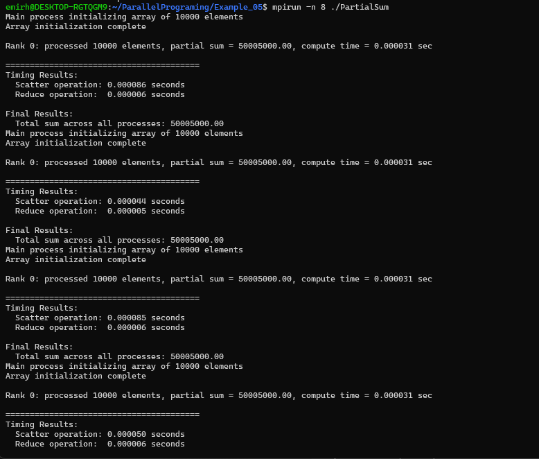
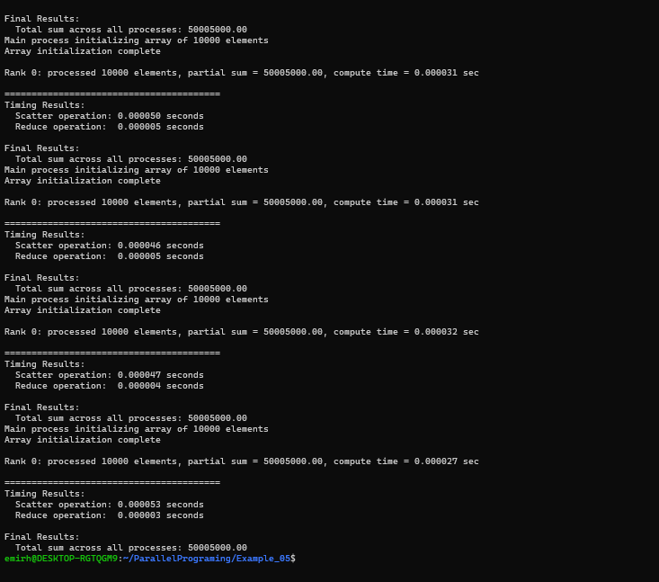

Example_05 – MPI Partial Sum (MPI_Scatterv + MPI_Reduce)

This project is based on the lab materials for the Parallel Programming course.
The goal is to compute the sum of an array in parallel using MPI collective communication.

Main steps in this program:

• rank 0 allocates and initializes a global array of ncells = 10000
• all processes determine how many elements they will handle (nsize) and their starting offset
• the array is distributed to all processes using MPI_Scatterv
• each process computes a local partial sum
• MPI_Reduce is used to collect all partial sums into rank 0
• timings are measured for scatter and reduce phases

Files in this folder:

• PartialSum.c – main MPI implementation
• timer.c – timing utilities (cpu_timer_start / cpu_timer_stop)
• timer.h
• Makefile – build rules for mpicc and mpirun

How to build (WSL2 + MPICH)

Open WSL terminal

Navigate to the folder:
cd ~/ParallelPrograming/Example_05

Build executable:
make

This produces:
./PartialSum

How to run:

Run with 1 process:
mpirun -n 1 ./PartialSum

Run with 2 processes:
mpirun -n 2 ./PartialSum

Run with 4 processes:
mpirun -n 4 ./PartialSum

Run with 8 processes (recommended):
mpirun -n 8 ./PartialSum

MPI functions used:

• MPI_Allgather – gathers local sizes so Scatterv knows offsets
• MPI_Scatterv – distributes different-sized chunks to each rank
• MPI_Reduce – collects partial sums to compute final sum

Expected result for an array 1..10000:
Total sum = 50005000

mpirun -n 4 ./PartialSum

Run with 8 processes (recommended):
mpirun -n 8 ./PartialSum

MPI functions used:

• MPI_Allgather – gathers local sizes so Scatterv knows offsets
• MPI_Scatterv – distributes different-sized chunks to each rank
• MPI_Reduce – collects partial sums to compute final sum

Expected result for an array 1..10000:
mpirun -n 8 ./PartialSum

MPI functions used:

• MPI_Allgather – gathers local sizes so Scatterv knows offsets
• MPI_Scatterv – distributes different-sized chunks to each rank
• MPI_Reduce – collects partial sums to compute final sum

Expected result for an array 1..10000:
mpirun -n 8 ./PartialSum

MPI functions used:

• MPI_Allgather – gathers local sizes so Scatterv knows offsets
• MPI_Scatterv – distributes different-sized chunks to each rank
• MPI_Reduce – collects partial sums to compute final sum

Expected result for an array 1..10000:
mpirun -n 8 ./PartialSum

MPI functions used:

• MPI_Allgather – gathers local sizes so Scatterv knows offsets
• MPI_Scatterv – distributes different-sized chunks to each rank
• MPI_Reduce – collects partial sums to compute final sum

Expected result for an array 1..10000:
Total sum = 50005000

