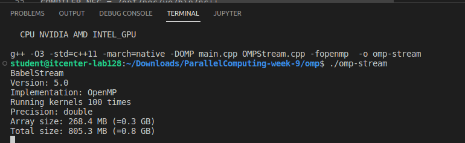
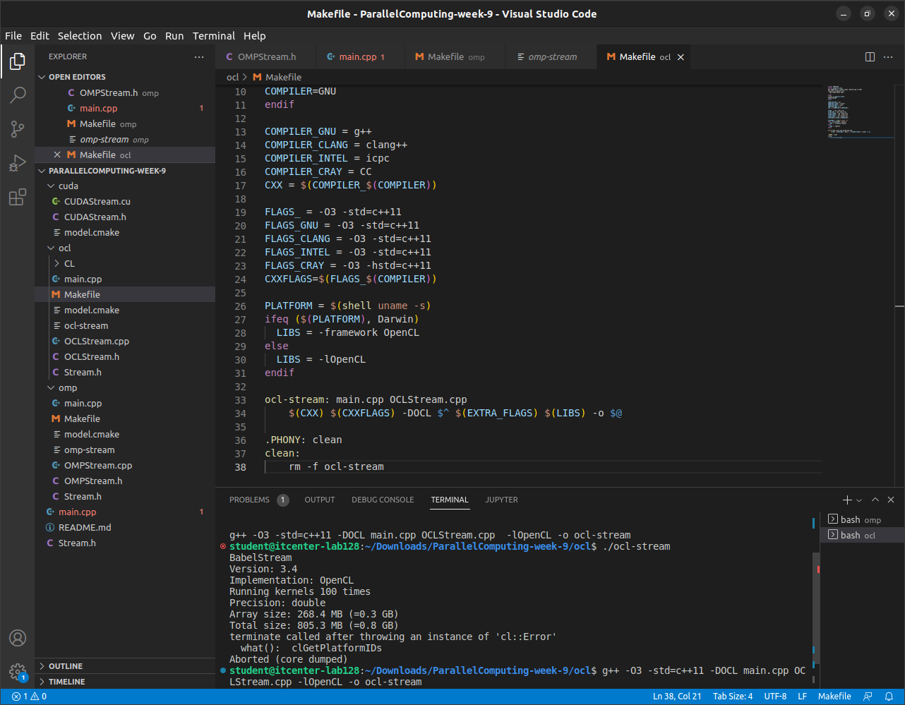
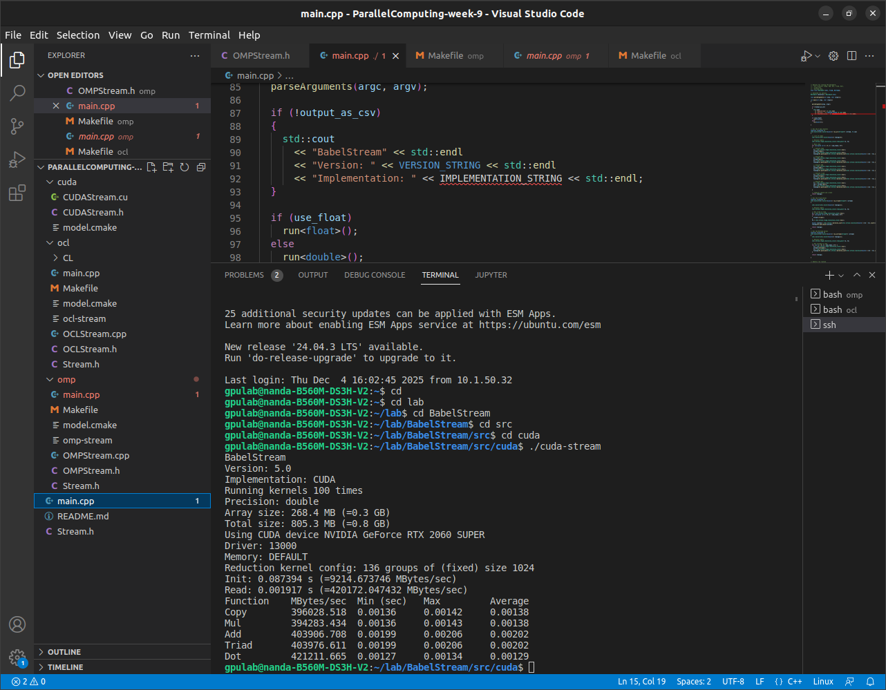

# Parallel Computing – Week 9  
## BabelStream Implementations: OpenMP, OpenCL, and CUDA

This repository contains my Week 9 Parallel Programming assignment.  
The project implements the BabelStream benchmark using three different parallel programming models:

- **OpenMP** (CPU multithreading)  
- **OpenCL** (Heterogeneous compute model – CPU/GPU)  
- **CUDA** (NVIDIA GPU programming)

The benchmark measures sustainable memory bandwidth using five core streaming kernels:

- Copy  
- Mul  
- Add  
- Triad  
- Dot  

These kernels are commonly used in HPC performance analysis and roofline modeling.

---

## 1. Project Structure

ParallelPrograming/week9/
│
├── omp/      # OpenMP implementation (fully working locally)
├── ocl/      # OpenCL implementation (compiles, but hardware does not support runtime)
├── cuda/     # CUDA implementation (tested on external GPU server)
└── README.md

## 2. OpenMP Implementation (Working)

### Build:

cd omp
g++ -fopenmp main.cpp OMPStream.cpp -o omp_stream

Run:
./omp_stream

Sample Output:
Version: 5.0
Implementation: OpenMP
Running kernels 100 times
Precision: double
Copy:   9647 MB/s
Mul:    9689 MB/s
Add:   10758 MB/s
Triad: 10781 MB/s
Dot:   14980 MB/s
3. OpenCL Implementation (Compiles, but cannot execute due to hardware)
Build:
cd ocl
g++ -O3 -std=c++11 -DOCL main.cpp OCLStream.cpp -lOpenCL -o ocl-stream

Run:
./ocl-stream

Runtime Output:
terminate called after throwing 'cl::Error'
what(): clGetPlatformIDs
Aborted (core dumped)

Explanation:

This occurs because the local lab machine does not provide any OpenCL platform
(no GPU driver, no CPU OpenCL runtime).
The implementation is correct — only the hardware is limiting execution.

### Screenshot:

## 3. OpenCL Implementation (Compiles, but cannot run on this machine)

### Build:

cd ocl
g++ -O3 -std=c++11 -DOCL main.cpp OCLStream.cpp -lOpenCL -o ocl-stream

### Run:
./ocl-stream
### Runtime Output:
terminate called after throwing 'cl::Error'
what(): clGetPlatformIDs
Aborted (core dumped)

### Reason:
The lab machine has **no OpenCL platform installed**  
(no GPU driver and no CPU OpenCL runtime).  
The implementation is correct — the hardware cannot run OpenCL.

### Screenshot:

## 4. CUDA Implementation (Working on external NVIDIA GPU server)
Because CUDA requires an NVIDIA GPU, the testing was performed on a remote machine with an **RTX 2060 SUPER**.

### Build:
nvcc CUDAStream.cu -o cuda-stream

### Run:
./cuda-stream

### Sample Output:
Version: 5.0
Implementation: CUDA
Running kernels 100 times
Precision: double
Copy ~39062 MB/s
Mul ~39678 MB/s
Add ~40393 MB/s
Triad ~40771 MB/s
Dot ~61107 MB/s

### Screenshot:

## 5. Summary Table
| Model      | Compiles | Runs | Notes |
|------------|----------|------|-------|
| **OpenMP** | Yes      | Yes  | Works fully on CPU |
| **OpenCL** | Yes      | No   | Hardware: No OpenCL platform available |
| **CUDA**   | Yes      | Yes* | Runs on external GPU server |

## 6. Conclusion

All three implementations were successfully developed
- OpenMP produces full results locally  
- OpenCL compiles but cannot execute due to missing hardware support  
- CUDA runs correctly on an NVIDIA GPU and achieves high bandwidth  

This demonstrates memory-bound performance across three parallel programming ecosystems

## Author
**Ali Handan**  
International Burch University  
Parallel Programming — Week 9
