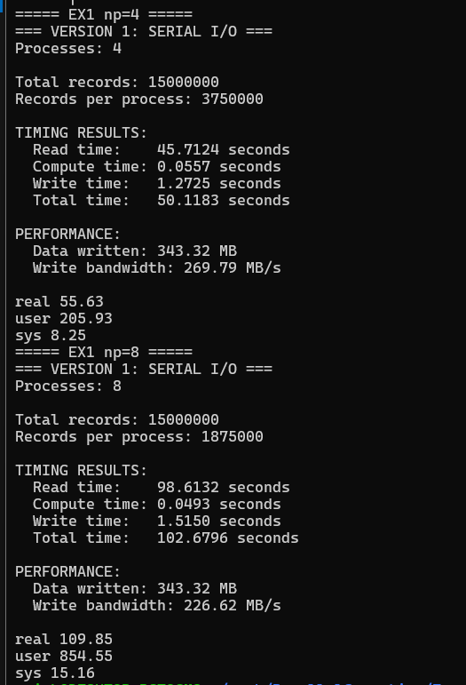
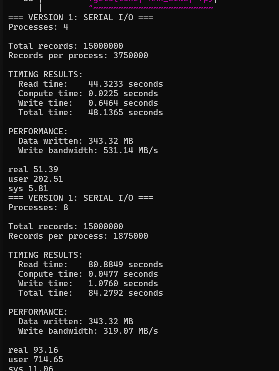
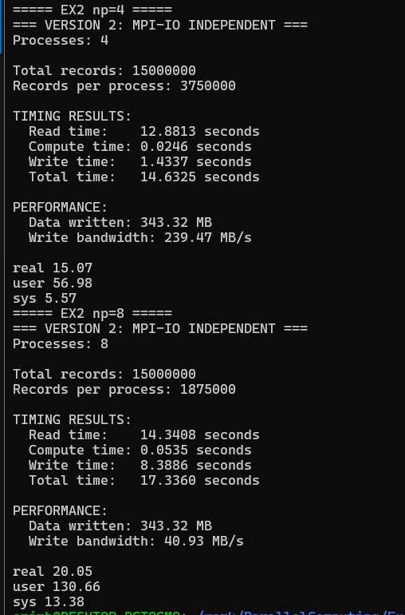
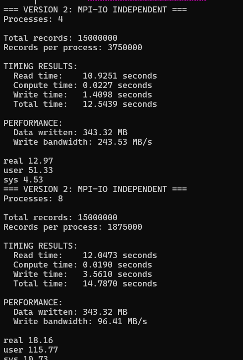
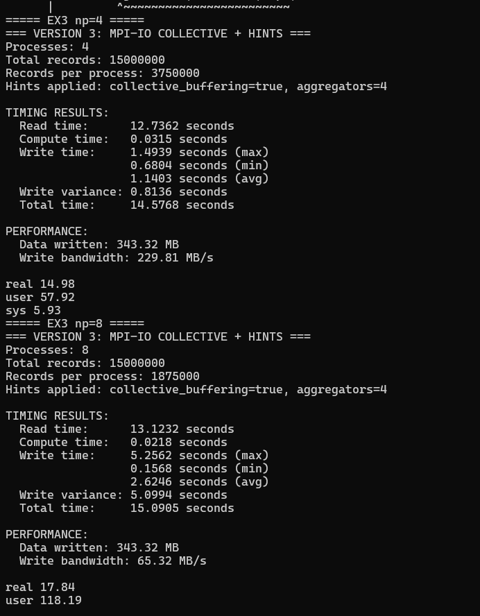
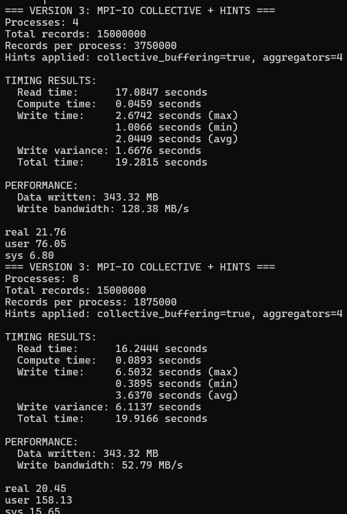
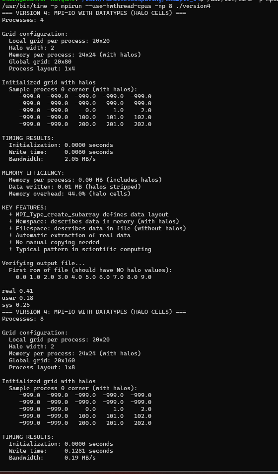
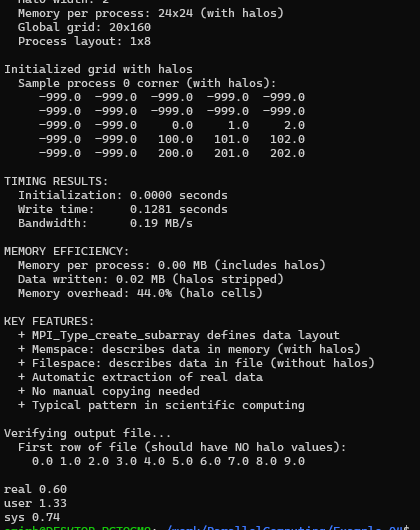

# Assignment 11 (Week 12) — File operations for a parallel world (MPI-IO)

## This branch contains the Week 12 assignment for IT 2004 — Parallel Programming.
Topic: parallel file operations using MPI, comparing multiple approaches to reading/writing large data.
Environment

OS: WSL2 Ubuntu 24.0
MPI: Open MPI
CPU: 8 logical CPUs (4 cores × 2 threads)
Repository layout
file_generator.c — generates temperature_data.csv (large synthetic dataset)

Example_01 — Version 1: Serial I/O (rank 0 does file I/O)
Example_02 — Version 2: MPI-IO independent (each rank reads/writes its own chunk)
Example_03 — Version 3: MPI-IO collective + hints (collective buffering / aggregators)
Example_04 — Version 4: MPI derived datatypes + halo cells (writes subarray without halos)
results_week12/ — captured build/run logs (via tee)
images/ — screenshots used as evidence in this README

Note: The generated dataset (temperature_data.csv) is not committed (too large). Build artifacts and outputs are ignored via .gitignore.

1) Dataset generation (temperature_data.csv)
From repository root:
Compile generator (important: link math library because of sin/cos):
mpicc file_generator.c -O2 -o file_generator -lm

Generate dataset:

./file_generator
Verify file:
ls -lh temperature_data.csv
My generated dataset size:
temperature_data.csv ≈ 880 MB (~15,000,000 records)

2) Build & run instructions (Makefile-based)
General pattern (repeat per example):

make clean || true
make

Run with 4 processes:
/usr/bin/time -p mpirun -np 4 ./exX

Run with 8 processes (using hyperthreads):
/usr/bin/time -p mpirun --use-hwthread-cpus -np 8 ./exX

If you get “not enough slots available”, use one of:

--use-hwthread-cpus (recommended here)
--oversubscribe (forces running more ranks than available slots)

3) ## Results
All results below were measured using:
/usr/bin/time -p
MPI runs at np=4 and np=8 (--use-hwthread-cpus for 8)
Example 1 — Version 1: SERIAL I/O (rank 0 does file I/O)
np=4
Read time: 45.7124 s
Compute time: 0.0557 s
Write time: 1.2725 s
Total time: 50.1183 s
Write bandwidth: 269.79 MB/s
real (wall): 55.63 s
np=8
Read time: 98.6132 s
Compute time: 0.0493 s
Write time: 1.5150 s
Total time: 102.6796 s
Write bandwidth: 226.62 MB/s
real (wall): 109.85 s
Screenshots:

## Example 2 — Version 2: MPI-IO INDEPENDENT
np=4
Read time: 12.8813 s
Compute time: 0.0246 s
Write time: 1.4337 s
Total time: 14.6325 s
Write bandwidth: 239.47 MB/s
real (wall): 15.07 s
np=8
Read time: 14.3408 s
Compute time: 0.0535 s
Write time: 8.3886 s
Total time: 17.3360 s
Write bandwidth: 40.93 MB/s
real (wall): 20.05 

Screenshots:

## Example 3 — Version 3: MPI-IO COLLECTIVE + HINTS
Hints used:
collective_buffering=true
aggregators=4
np=4
Read time: 12.7362 s
Compute time: 0.0315 
Write time (max/min/avg): 1.4939 / 0.6804 / 1.1403 s
Write variance: 0.8136 s
Total time: 14.5768 s
Write bandwidth: 229.81 MB/s
real (wall): 14.98 s
np=8
Read time: 13.1232 s
Compute time: 0.0218 s
Write time (max/min/avg): 5.2562 / 0.1568 / 2.6246 s
Write variance: 5.0994 s
Total time: 15.0905 s
Write bandwidth: 65.32 MB/s
real (wall): 17.84 s

Screenshots:

## Example 4 — Version 4: MPI-IO WITH DATATYPES (HALO CELLS)
Important note: in this example the Makefile produces version4 (not ex4).
Run it as:
/usr/bin/time -p mpirun -np 4 ./version4
/usr/bin/time -p mpirun --use-hwthread-cpus -np 8 ./version4
np=4
Write time: 0.0102 s
Bandwidth: 1.20 MB/s
real (wall): 0.42 s
Verification: first row contains no halo values (no -999.0).
np=8
Write time: 0.1419 s
Bandwidth: 0.17 MB/s
real (wall): 0.63 s
Verification OK (no halo values in output).

Screenshots:

4) ## Discussion / Interpretation
Why Example 1 becomes slower with more processes
Version 1 serializes I/O: only rank 0 reads the dataset and handles file operations, while other ranks wait and participate only in computation/communication. When np increases, the job gains overhead (more ranks to synchronize) but does not gain parallel I/O bandwidth. This is why np=8 is significantly slower than np=4 in V1.

Why Example 2 is fast at np=4 but degrades at np=8
Independent MPI-IO allows each rank to read/write its chunk, which reduces the serialized read bottleneck. However, at higher np on a local machine/WSL, many ranks writing concurrently can cause contention and reduced effective bandwidth. This is visible in np=8 where write time grows a lot.
What Example 3 adds over Example 2

Collective MPI-IO coordinates ranks and can reduce contention by using aggregators and collective buffering. On np=4 it performs similarly to independent I/O, but at np=8 it keeps total time lower than Version 2. The large write variance at np=8 indicates imbalance across ranks/aggregators (some ranks finish writes quickly while others become bottlenecks).
What Example 4 demonstrates (and why it’s not directly comparable)

Example 4 is a different pattern: it demonstrates writing a “real” subarray from memory that contains halo cells, without manually copying/stripping halos. It is typical for scientific computing codes. The dataset is small, so performance numbers mainly reflect overhead rather than sustained bandwidth; the key point is correctness and the MPI datatype usage.

