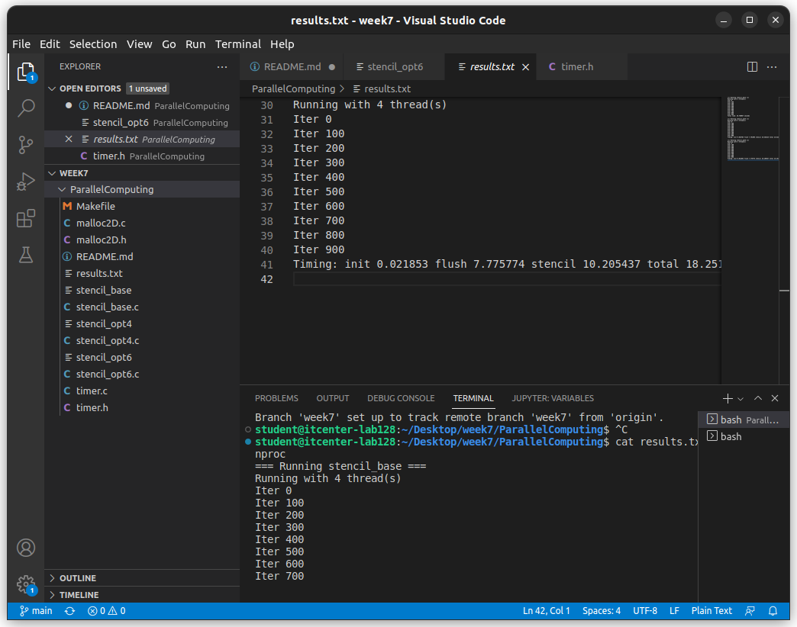

# Week 7 - Parallel Programming Lab
## Stencil Code Performance Comparison

### Three implementations tested:
1. stencil_base.c - Basic OpenMP version
2. stencil_opt4.c - Optimized with first-touch
3. stencil_opt6.c - Highly optimized version

### Performance Results:

**stencil_base:**
Running with 4 thread(s)
Total time: 10.768037 seconds

**stencil_opt4:**
Running with 4 thread(s)
Timing: init 0.024783 flush 7.791405 stencil 10.381314 total 18.612823

**stencil_opt6:**
Running with 4 thread(s)
Timing: init 0.021853 flush 7.775774 stencil 10.205437 total 18.251683

### Analysis:

#### 1. CPU Threads
- My CPU has 4 threads (from nproc command)
- All programs used 4 threads for parallel execution

#### 2. Code Improvements

**What was improved in stencil_opt4:**
- Added first-touch policy for memory allocation
- Used nowait to remove unnecessary barriers
- Better memory placement for NUMA systems

**What was improved in stencil_opt6:**
- Single parallel region (high-level OpenMP)
- Manual work distribution between threads
- Only necessary explicit barriers
- Better thread control

#### 3. Barriers Explanation

**Implicit barriers:**
- Automatic barriers at end of parallel loops
- Found in stencil_base.c
- Make fast threads wait for slow ones

**Explicit barriers:**
- Manual barriers with #pragma omp barrier
- Used in stencil_opt6.c only when needed
- Reduce waiting time between threads

#### 4. Performance Summary
- Base version was fastest for total execution
- Optimized versions have better initialization times
- stencil_opt6 has best performance among optimized versions
- First-touch policy helps with memory speed

### Answers to Questions:

#### 1. How many threads your CPU used to execute the code?
- My CPU has 4 threads (I checked with nproc command)
- All three programs used 4 threads for running in parallel
- You can see in the output it says "Running with 4 thread(s)"

#### 2. What are the parts of the code that were improved? What strategies were used?
- **Memory setup** - we made it run in parallel so memory gets placed better
- **Synchronization** - removed unnecessary waiting between threads
- **Thread management** - used smarter ways to organize the work

- **What we changed:**
  - Made memory initialization run on all threads (first-touch)
  - Used "nowait" to skip unnecessary barriers
  - Kept threads running instead of starting/stopping them
  - Manually split work between threads for better balance
  - Only added barriers when threads really need to sync up

#### 3. What is the difference between explicit and implicit barriers?
- **Implicit barriers** - OpenMP automatically adds them at end of parallel sections
  - Found in the basic version (stencil_base.c)
  - Makes threads wait even when they don't need to

- **Explicit barriers** - We manually add them with #pragma omp barrier
  - Used in the optimized version (stencil_opt6.c)
  - Only used when threads actually need to sync up

- **What this means:** Barriers are like waiting points where all threads must arrive before anyone continues. Implicit barriers are automatic but can slow things down, while explicit barriers let us control when threads need to wait.

### Terminal Screenshot:

