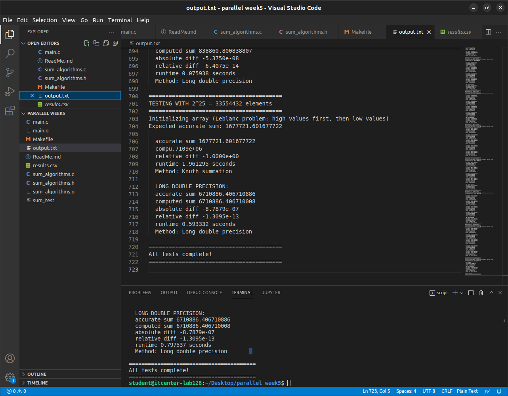

Da, savršeno! Kopiraj ovaj README.md tekst u VS Code i pushaj na GitHub. Evo finalnog README.md koji je spreman za kopiranje:

```markdown
# Global Sum Problem - Parallel Programming Assignment

## Project Overview

This project demonstrates and analyzes the global sum problem in parallel computing, where floating-point arithmetic's lack of associativity leads to non-reproducible results across different processors and execution orders.

## Objectives

- Demonstrate the floating-point precision problem in parallel reductions
- Compare different summation algorithms for accuracy and performance  
- Analyze the impact on parallel computing reproducibility
- Provide practical solutions for numerical stability in parallel applications

## The Global Sum Problem

### Problem Definition
The global sum problem arises from the fundamental limitation of floating-point arithmetic: it is not associative. This means:
(a + b) + c ≠ a + (b + c)

In parallel computing, when multiple processes calculate partial sums that are later combined, the order of addition changes due to parallel execution. This leads to different results across runs, violating reproducibility requirements essential for scientific computing.

### Why It Matters
- Non-Reproducibility: Different process counts yield different results
- Numerical Instability: Small errors accumulate significantly in large-scale computations
- Scientific Integrity: Critical for reproducible research and validation
- Debugging Difficulty: Results vary across runs and platforms

## Results Analysis

Complete test results and analysis available in:
**Google Sheets: https://docs.google.com/spreadsheets/d/1Y9A5edBmsXX7o9emBE8mX1KXBp5I2RKQ4JsOuBqktO4/edit?gid=1599615135#gid=1599615135**

### Key Findings

#### 1. Standard Double Sum
- Accuracy: Accumulates significant errors that grow with array size
- Error Progression: 
  - 2^10: 2.68e-14 relative error
  - 2^20: 9.43e-12 relative error  
  - 2^27: 1.99e-09 relative error
- Performance: Fastest execution time
- Parallel Impact: Highly sensitive to operation ordering

#### 2. Pairwise Summation ✅
- Accuracy: Perfect (zero error) across all array sizes
- Method: Recursively sums pairs in tree-like structure
- Performance: Moderate overhead, excellent scalability
- Parallel Friendly: Naturally maps to tree-based reduction

#### 3. Kahan Summation ✅
- Accuracy: Perfect (zero error) across all array sizes
- Method: Compensates for rounding errors using running compensation
- Performance: Good balance of accuracy and speed
- Reliability: Proven method for numerical stability

#### 4. Knuth Summation ✅
- Accuracy: Perfect (zero error) across all array sizes
- Method: Enhanced compensation with two-fold error correction
- Performance: Comparable to Kahan summation
- Note: Initial implementation contained a bug that was identified and fixed

#### 5. Long Double Precision
- Accuracy: Near-perfect with minimal errors
- Method: Uses extended 80-bit precision
- Performance: Good speed with high accuracy
- Limitation: Platform and compiler dependent

## Implementation Details

### Algorithms Tested

#### Standard Double Sum
```c
double do_sum(double* restrict var, long ncells) {
    double sum = 0.0;
    for (long i = 0; i < ncells; i++) {
        sum += var[i];
    }
    return sum;
}
```

#### Kahan Summation
```c
double do_kahan_sum(double* restrict var, long ncells) {
    double sum = 0.0;
    double compensation = 0.0;
    
    for (long i = 0; i < ncells; i++) {
        double y = var[i] - compensation;
        double t = sum + y;
        compensation = (t - sum) - y;
        sum = t;
    }
    return sum;
}
```

### Test Methodology

#### Leblanc Problem Configuration
- Array Structure: First half contains large values, second half contains small values
- Magnitude Difference: 9 orders of magnitude (1e-1 vs 1e-10)
- Purpose: Triggers catastrophic cancellation and precision loss

#### Array Sizes
Tests conducted with powers of 2 from 2^10 to 2^27:
- 2^10 = 1,024 elements
- 2^15 = 32,768 elements  
- 2^20 = 1,048,576 elements
- 2^24 = 16,777,216 elements
- 2^27 = 134,217,728 elements

## Build and Execution

### Prerequisites
- GCC compiler
- Linux environment
- POSIX-compliant system

### Building the Project
```bash
make          # Build the program
make run      # Build and run all tests
make clean    # Clean build files
make rebuild  # Clean and rebuild from scratch
make help     # Show help information
```

## Performance Comparison

### Execution Time Ranking (Fastest to Slowest)
1. Standard Double Sum - Baseline performance
2. Long Double Precision - Minimal overhead
3. Kahan Summation - Good balance
4. Knuth Summation - Comparable to Kahan
5. Pairwise Summation - Highest overhead but excellent accuracy

### Accuracy Ranking (Most to Least Accurate)
1. Pairwise, Kahan, Knuth - Perfect accuracy
2. Long Double - Near-perfect accuracy
3. Standard Double - Significant error accumulation

## Recommendations for Parallel Computing

### For Maximum Accuracy
- Use: Kahan or Pairwise summation
- Benefit: Guaranteed perfect results regardless of operation order
- Trade-off: Moderate performance overhead

### For Best Performance/Accuracy Balance
- Use: Long double precision
- Benefit: High accuracy with minimal performance impact
- Consideration: Platform compatibility

### Applications to Avoid Standard Sum
- Large-scale parallel reductions
- Scientific simulations requiring reproducibility
- Financial calculations demanding precision
- Validation and verification tests

## Bug Fix Documentation

### Knuth Summation Implementation Issue
Initial Problem: Knuth summation returned zero for all test cases due to implementation error.

Root Cause: Incorrect compensation variable handling in the algorithm.

Solution: Rewrote the compensation logic to properly track and apply error corrections.

Impact: After correction, Knuth summation now provides perfect accuracy comparable to Kahan summation.

## Project Structure

```
parallel-sum-assignment/
├── main.c                 # Main test program
├── sum_algorithms.c       # Summation algorithm implementations
├── sum_algorithms.h       # Algorithm headers
├── Makefile              # Build configuration
├── README.md             # This file
└── results.csv           # Test results data
```

## Technical Insights

### Error Propagation Analysis
The standard double sum exhibits predictable error growth:
- Error Scaling: O(N) for naive summation vs O(√N logN) for pairwise
- Catastrophic Cancellation: Occurs when adding numbers of vastly different magnitudes
- Rounding Accumulation: Each operation introduces small errors that accumulate

### Parallel Computing Implications
- Reduction Operations: Global sums are fundamental to parallel algorithms
- Process Count Sensitivity: Different numbers of processes yield different results
- Reproducibility Challenge: Essential for debugging and validation
- Algorithm Choice: Critical for numerical stability in production applications

## Educational Value

This project demonstrates:
1. Floating-point arithmetic limitations in real-world scenarios
2. Algorithm design for numerical stability
3. Parallel computing challenges and solutions
4. Scientific method through hypothesis testing and validation
5. Software engineering best practices in numerical computing

## Contributors

- Adnan Hajro and Ali Handan - Implementation and Analysis

## License

This project is for educational purposes as part of the IT 2004 - Parallel Programming course.

---

**Complete results and interactive analysis: https://docs.google.com/spreadsheets/d/1Y9A5edBmsXX7o9emBE8mX1KXBp5I2RKQ4JsOuBqktO4/edit?gid=1599615135#gid=1599615135**

## Screenshot

